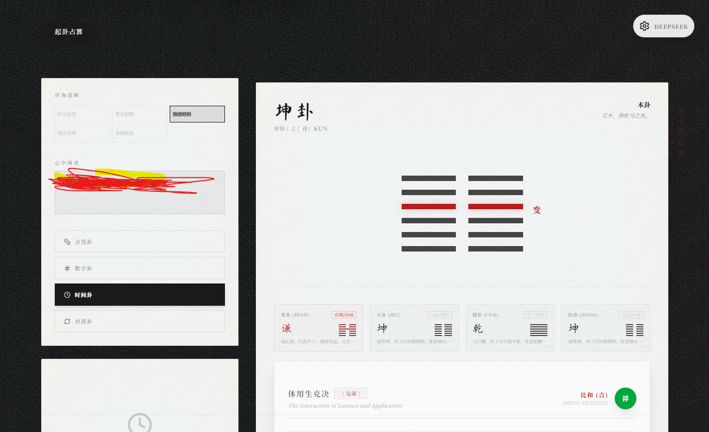
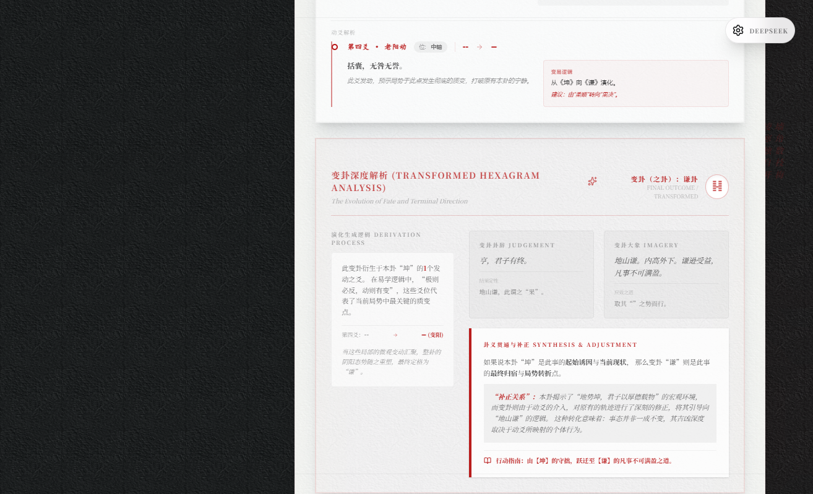
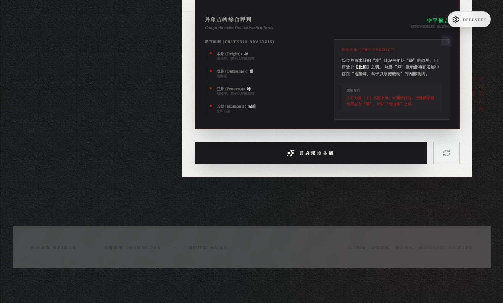
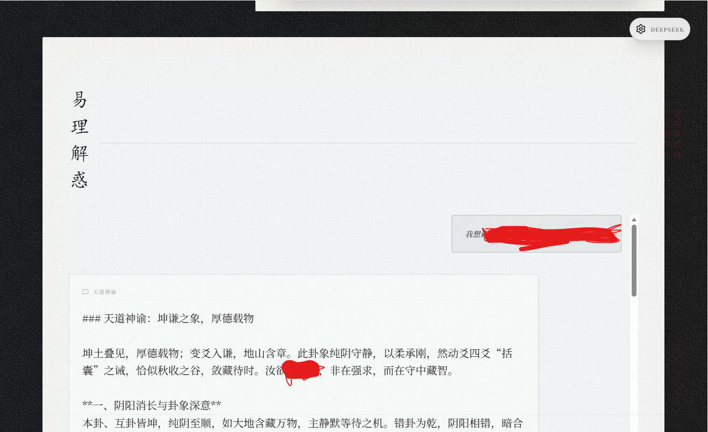

# 天道玄机 (Tian Dao Xuan Ji) - 全栈易经八字命理分析平台

## 1. 项目概述

### 1.1 项目愿景

“天道玄机”不仅仅是一个简单的占卜工具，它是一座桥梁，旨在运用现代前端技术（React + Tailwind + AI）去解构并呈现博大精深的中华传统易学。本项目通过数字化的方式，将数千年前的《易经》智慧与当代复杂系统的逻辑思维相结合，为用户提供一个深度、直观且富有美感的人生决策辅助平台。

### 1.2 核心理念

* **数位解易**：使用二进制（Bit-wise）逻辑重构64卦象，实现卦象演化的精确计算。
* **万物演化**：不仅关注当前卦（本卦），更关注动态变化（变卦）、内部动因（互卦）、反面视角（错卦）与因果循环（综卦）。
* **体用平衡**：引入五行生克体系，从微观能量角度判别吉凶方向。
* **AI 智断**：利用大语言模型（Gemini/DeepSeek）的自然语言理解能力，将干涩的古文转化为具有现实指导意义的人生建议。

### 1.3 效果预览 (Preview)

|               1. 结果概览               |               2. 变卦解析               |
| :-------------------------------------: | :-------------------------------------: |
|  |  |
|          **3. 综合评判**          |          **4. AI 对话**          |
|  |  |

---

## 2. 核心功能详述

### 2.1 易经演化系统 (I Ching Evolution System)

#### 2.1.1 数字化起卦逻辑

系统模拟传统的“三钱法”，通过高随机性的算法逻辑，为每一爻生成“少阴、少阳（静）”或“老阴、老阳（动）”的状态。

* **动爻识别**：精准捕捉能量发生质变的点（动爻），并实时计算其产生的“之卦”（变卦）。
* **五卦合参**：
  * **本卦 (Original)**：当前的格局与现状。
  * **变卦 (Changed)**：事物发展的最终归宿与结果。
  * **互卦 (Mutual)**：事物的内部结构与隐藏动因。
  * **错卦 (Opposite)**：对方的立场或事物的对立面。
  * **综卦 (Inverse)**：换个角度看问题，即事物的反面逻辑。
* **纳甲六爻**：基于经典纳甲筮法自动装卦——纳甲干支、六亲（父母/兄弟/子孙/妻财/官鬼，以卦宫五行为坐标）、世应（八宫卦序定位）、六神（青龙/朱雀/勾陈/腾蛇/白虎/玄武，依起卦日天干定初爻）。

#### 2.1.2 爻位深度解析

系统为每一个爻位配置了详尽的数据库支持：

* **爻辞与象传**：原文呈现。
* **易学典故**：结合历史经典（如文王羑里演易、汉高祖入关等）进行形象化解释。
* **时位逻辑**：解析初、二、三、四、五、上爻在时空位置上的象征意义（如“潜龙勿用”对应初爻，“飞龙在天”对应五爻）。
* **先天/后天八卦方位**：解析该爻所属支卦在宇宙空间模型中的方位关系。

#### 2.1.3 体用关系与吉凶判断

基于“五行生克”原理，系统自动识别“体卦”（主方）与“用卦”（客方）：

* 计算体用之间的生、克、比和关系。
* 自动输出吉凶综合评价（大吉、小吉、平稳、凶等）。

### 2.2 八字命理引擎 (Bazi Horoscope Engine)

* **万年历转换**：内置公历与农历/干支历的精确转换算法，支持跨越数百年的时间轴。
* **四柱解析**：根据年、月、日、时生成八柱，识别天干地支及其组合出的十神关系。
* **日主核心**：以“日元”为中心，分析由于五行多寡带来的性格底色。
* **纳音与生肖**：四柱纳音（海中金、炉中火等）与年柱生肖自动标注。
* **五行补益**：自动识别命局缺行之五行，并给出方位、色彩、物象等温和调候建议。
* **格局判定**：依据月令与日主的生克关系判定建禄、阳刃、月劫、财官、食伤、印绶等格局。
* **大运流年**：按阳男阴女顺排、阴男阳女逆排推算起运时间，展示大运（每步十年）与当前大运的十年流年。
* **辅星三垣**：胎元、命宫、身宫、胎息及其纳音自动推算。
* **藏干十神**：四柱地支本气藏干的十神标注（与天干十神配套）。
* **神煞星曜**：天乙贵人、文昌、桃花、驿马、华盖、将星、羊刃、禄神、魁罡、孤辰寡宿、空亡等自动查表标注。
* **喜用神与幸运元素**：身强身弱判定 → 喜用/忌神五行 → 幸运数字（河图数）、颜色、方位、佩戴推荐。
* **流月流日**：当前流月、十二流月（自立春起）、今日流日与命局冲合提示。
* **大运逐运解读**：一键 AI 逐一解读八步大运的人生主题与行事建议。

### 2.3 宇宙论可视化 (Cosmology Visuals)

系统开发了一套基于 SVG 的动态可视化组件，帮助用户理解抽象概念：

* **河图 (He Tu)**：展示北方水、东方木、南方火、西方金、中央土的数字排列逻辑。
* **洛书 (Luo Shu)**：呈现“戴九履一，左三右七”的神奇九宫幻方。
* **先天/后天八卦方位图**：通过中心环绕式布局，展示宇宙能量的两种排列方式。

### 2.4 今日黄历 (Daily Almanac)

页面底部常驻“今日黄历”面板，依据中华传统历法实时推算：

* 农历干支日期、生肖、节气与节日。
* 每日宜忌（吉神宜趋、凶煞宜忌自动标注）。
* 冲煞、建除十二值星、值日天神（黄道/黑道）、二十八宿、彭祖百忌。
* 喜神、财神、福神、阳贵、阴贵等神煞方位。
* **十二时辰吉凶**：逐时辰宜忌与值日天神，当前时辰高亮。
* **今日卦签**：每日依日期种子恒定抽取一卦，可一键 AI 解签。
* **节气倒计时**：实时显示距离下一节气的时间。
* **分享功能**：卦签与卦象可一键生成水墨风分享海报（canvas 绘制）或复制文案。

### 2.5 择吉日 (Auspicious Days)

* 选择事项类型（嫁娶/开市/入宅/出行/动土/安葬/祈福/签约/祭祀）与月份。
* 依据当日宜忌命中、黄道黑道、建除十二值星、吉神与冲月综合评分（0-100）。
* 日历视图逐日着色，自动标出本月上吉三日与适宜日，点击查看当日详情。

### 2.6 合婚问姻 (Marriage Compatibility)

* **生肖合婚**：两人生肖的六合、三合、六冲、相刑、相害关系自动判定与解读。
* **八字合婚**：双方四柱并排对比，综合生肖关系、日主生克、五行互补、月令合冲计算缘分指数（0-100），并支持 AI 深度合婚解读。

### 2.7 AI 大师解析助手 (AI Metaphysics Master)

整合了顶尖的大型语言模型，扮演“天道先生”角色，提供不同维度的深度对话：

* **综合运势**：对整个卦象的全局把控。
* **事业前程**：针对职业选择、进退之机的专业建议。
* **情感婚姻**：分析缘分深浅与相处之道。
* **财运求财**：洞察财富流向与获财时机。

---

## 3. 技术架构与实现逻辑

### 3.1 前端渲染层 (Frontend Layer)

* **框架**：基于 React 19，利用其强大的组件化能力构建复杂的 UI。
* **动画引擎**：使用 `motion`（framer-motion 后继）实现顺滑的路线切换和元素动效，模拟“太极变幻”的流体感。
* **样式体系**：采用 Tailwind CSS v4。项目中定义了一套自创的“玄学工业风”配色（墨黑、朱砂红、宣纸白），并辅以毛玻璃效果和细腻的边框纹理（Lattice corners）。
* **图标库**：`lucide-react`，精选与天象、自然相关的符号。
* **历法引擎**：`lunar-javascript`，提供公历/农历/干支的精确转换与四柱排盘。

### 3.2 数据处理层 (Data Logic)

* **二进制映射计算**：
  易经的六爻结构天然符合二进制逻辑（阳=1，阴=0）。系统使用 `010110` 这样的字符串来标识卦象。
  * **综卦实现**：通过对二进制字符串进行 `reverse()` 处理实现。
  * **错卦实现**：通过对字符串中的 0 和 1 进行镜像反转实现。
  * **互卦实现**：提取 234 爻作为下卦，345 爻作为上卦，重新拼接。
* **五行矩阵**：
  定义了一个 `relationMap` 字典，其中存有五行两两交互后的所有逻辑分支，时间复杂度为 O(1) 的查表法。

### 3.3 AI 交互层 (AI Integration)

* **SDK 应用**：直接集成 `@google/genai` 库，利用 Gemini 模型的长上下文能力。
* **提示词工程 (Prompt Engineering)**：系统通过精心撰写的 `SYSTEM_PROMPT` 将模型引导为一位谦逊、睿智且博学的文化导师，使其生成的每一个回复都带有深厚的文学色彩。
* **Context 管理**：实现了对话历史管理，用户可以针对某个卦象进行连续追问。

---

## 4. UI 视觉设计哲学

### 4.1 “墨意与现代”的碰撞

本项目在设计上摒弃了市面上大多数命理软件使用的廉价黄金或大红大绿配色，而是选择了极具高级感的中国水墨画风：

* **纸张质感**：背景并非纯白，而是模拟宣纸或陈年典籍的浅灰色。
* **朱砂点睛**：在关键的动爻、吉凶判断处，使用具有仪式感的朱砂红（Imperial Red）作为强调色。
* **书法韵味**：在标题和重要符号处，尝试引入具有毛笔质感的字体设计。

### 4.2 响应式体验

虽然易经逻辑复杂，但项目在 UI 上做了极致的精简：

* **卡片化布局**：即使在手机端，用户也能顺畅地完成摇卦、看图、对话的完整闭环。
* **多维度切换**：通过平滑的 Tab 拨片或按钮，在卦象解析、爻位详情、AI 对话之间无缝跳转。

---

## 5. 项目亮点细节

### 5.1 卦象演化进度条

在卦象结果页，系统会自动生成一段富有哲理的演化描述：

> “目前处于【乾】之势，由于能量在【九五】位的剧烈波动，正在向【大有】卦演化。”
> 这种叙述方式让用户感受到事物的流动性，而非静态的结果。

### 5.2 符号化判读

引入卦画（䷀、䷁等）与自然符号（天、地、雷、风等）的配对展示，增强了非专业人士对卦象的感性认识。

### 5.3 错误捕获与容错处理

* 如果 AI 暂时不可用，系统提供自动生成的“离线分析建议”。
* 对于不完整的用户输入（如不合规范的出生时间），建立了完善的 UI 引导反馈。

---

## 6. 用户操作指南

1. **静心起卦**：进入系统，选择“易经占卜”，点击或摇动模拟钱币。
2. **观其象**：查看生成的本卦图像，理解其大环境。
3. **究其理**：向下滚动查看动爻详情，了解在哪些关键点发生了变化。
4. **察其势**：通过变卦解析，预见未来的最终发展。
5. **听其言**：点击 AI 深度对话，输入你最关心的具体问题（如“我该不该现在创业？”）。
6. **悟其道**：参考 AI 给出的“三段式”建议（简评、哲学解析、现实忠告）。

---

## 7. 开发路线与未来展望 (Roadmap)

* **多端同步**：支持 Firebase 账号同步，保存用户的历史占卜记录，生成长期的“命运走势图”。
* **三维可视化**：实现基于 Three.js 的立体太极球起卦动画。
* **社交分享**：支持生成精美的海报，将卦象与锦言一键分享至朋友圈。
* **奇门遁甲模块**：引入更复杂的时空模型，将地理方位与时间信息进一步结合。

---

## 8. 本地部署与运行指南 (Local Development)

> 📦 免费部署教程（Gitee Pages / GitHub Pages / EdgeOne / Vercel）与桌面端打包：见 **[DEPLOY.md](./DEPLOY.md)**

如果您希望在本地环境运行“天道玄机”项目，请参考以下操作流程：

### 8.1 环境要求

* **Node.js**: v18.x 或更高版本。
* **包管理工具**: npm, yarn 或 pnpm。
* **API 密钥**:
  * 项目默认支持 Google Gemini。
  * 可在 UI 设置面板中配置 OpenAI, DeepSeek, 阿里千问或智谱清言的密钥。

### 8.2 快速开始

1. **克隆仓库**：
   ```bash
   git clone https://github.com/xiaowei2025cqu23phy/tian-dao-xuan-ji.git
   cd tian-dao-xuan-ji
   ```
2. **安装依赖**：
   ```bash
   npm install
   ```
3. **配置环境变量（可选，仅本地开发）**：
   复制 `.env.example` 为 `.env` 并填入您的 API 密钥（如 `GEMINI_API_KEY`）。
   > ⚠️ **安全警告**：`.env` 已被 `.gitignore` 排除，切勿通过 `git add -f` 强制提交；生产构建（`npm run build`）内置安全守卫，若检测到真实密钥会直接报错终止，防止密钥被打包进产物并随部署泄露。
   >
4. **启动开发服务器**：
   ```bash
   npm run dev
   ```

   访问控制器提供的本地端口（默认为 `http://localhost:3000`）。

### 8.3 生产部署

```bash
npm run build
npm run preview   # 本地预览
npm run deploy    # 推送到 gh-pages 分支（可选）
```

---

## 9. 数据校验（Data Verification）

项目内置易学数据全量校验脚本，覆盖 64 卦二进制结构与卦序、错卦/综卦/互卦完备性、体用关系全矩阵（64×6）、爻辞完整性以及八字格局判定：

```bash
npm run verify:hexagrams
```

---

## 10. 密钥与隐私安全（Security）

* 所有 AI 服务的 API 密钥均**只保存在浏览器本地**（`localStorage`），不会上传至任何服务器。
* `.gitignore` 已排除 `.env*`（保留 `.env.example` 占位模板）；`git ls-files` 中不应出现任何 `.env` 文件。
* `vite.config.ts` 内置生产构建守卫：检测到非占位符的真实 `GEMINI_API_KEY` 时构建直接失败，杜绝密钥被内联进 JS 产物并推送到公开渠道。
* 若曾在历史提交中误提交过密钥，请立即轮换（revoke）该密钥，而非仅删除文件。

## 11. 图片来源与许可 (Image Attribution)

「易理图解」中的经典图来源如下：

| 图片                                              | 来源                                                                                                                                               | 许可                |
| ------------------------------------------------- | -------------------------------------------------------------------------------------------------------------------------------------------------- | ------------------- |
| 先天八卦方位图 (`src/assets/bagua-earlier.svg`) | Wikimedia Commons[File:Bagua-name-earlier.svg](https://commons.wikimedia.org/wiki/File:Bagua-name-earlier.svg)（作者 BenduKiwi / Machine Elf 1735） | CC BY-SA 3.0 / GFDL |
| 后天八卦方位图 (`src/assets/bagua-later.svg`)   | Wikimedia Commons[File:Bagua-name-later.svg](https://commons.wikimedia.org/wiki/File:Bagua-name-later.svg)（作者 BenduKiwi / Machine Elf 1735）     | CC BY-SA 3.0 / GFDL |
| 洛书九宫图 (`src/assets/luoshu-classic.svg`)    | Wikimedia Commons[File:Lo4shu1 Magic Square.svg](https://commons.wikimedia.org/wiki/File:Lo4shu1_Magic_Square.svg)（作者 Lamassu Design Gurdjieff） | CC BY-SA 3.0        |
| 河图 (`src/assets/hetu.svg`)                    | 本项目自绘（经典黑白点阵式）                                                                                                                       | 公共领域（自绘）    |

## 12. 结语

“天道无常，随机而变。”
本项目不仅旨在提供一种预测功能，更希望在这个信息爆炸、选择焦虑的时代，通过古老智慧的理性重构，帮每一个人找回内心的宁静与笃定。无论结果是吉是凶，易经的精神永远在于那四个字：**自强不息**。

---

© 2026 物理学渣小微 | 传承文明，启迪智慧。

## 13. 开源许可协议 (License)

本项目采用 **[CC BY-NC-SA 4.0](https://creativecommons.org/licenses/by-nc-sa/4.0/deed.zh-hans)** (署名-非商业性使用-相同方式共享) 许可协议。

* **必须开源**：基于本项目的任何演绎作品必须以相同的协议开源。
* **禁止商用**：严禁将本项目及其衍生版本用于任何商业盈利目的。
* **保留署名**：在衍生项目中必须保留原作者的署名信息。
